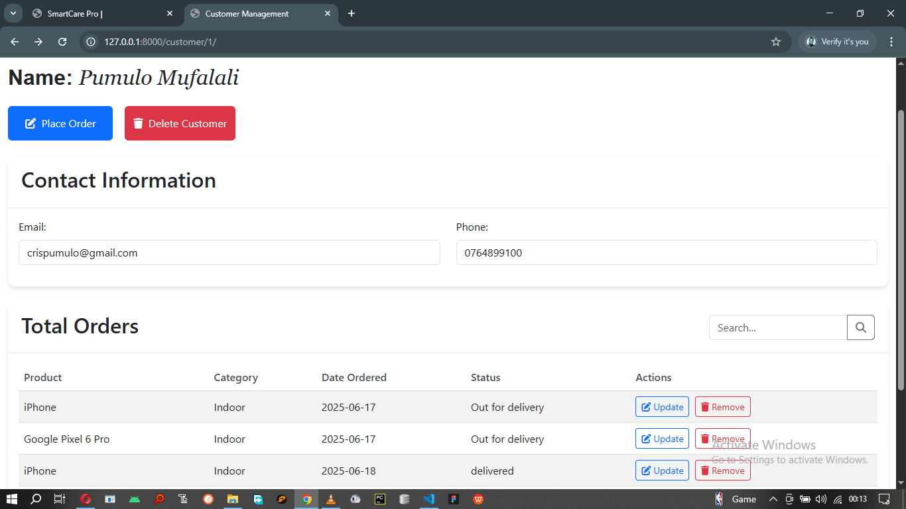

# CustomaKit

CustomaKit is a Django-based web application designed to manage customer orders efficiently. It allows businesses to track, create, and update orders for each customer in a streamlined and organized way.

## 📸 Screenshot



> _Example: Admin dashboard showing customer orders._  
> *(Replace `dashboard.png` with your actual image filename and place it in a `screenshots/` folder in your project root.)*

## Features

- Customer registration and management
- Order creation and tracking
- Order status updates (e.g. pending, completed, cancelled)
- Admin dashboard for managing customers and orders
- RESTful API support (optional)

## Tech Stack

- **Backend**: Django (Python)
- **Database**: SQLite (default), can be swapped for PostgreSQL/MySQL
- **Frontend**: Django Templates / Bootstrap (or your UI choice)

## Getting Started

### Prerequisites

- Python 3.8+
- pip
- virtualenv (recommended)

### Setup

```bash
# Clone the repo
git clone https://github.com/yourusername/customakit.git
cd customakit

# Create and activate virtual environment
python -m venv venv
source venv/bin/activate  # On Windows: venv\Scripts\activate

# Install dependencies
pip install -r requirements.txt

# Apply migrations
python manage.py migrate

# Start development server
python manage.py runserver
